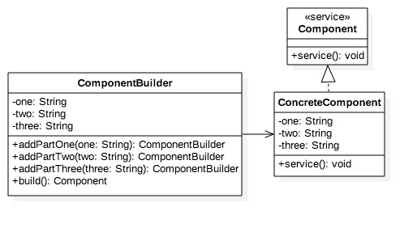

# Builder Design Pattern #

###Objective###
To build a complex object in a series of optional steps

###Structural Model###



###Illustration: Builder###

Component.java

```
package com.glarimy;

public interface Component {
	public void service();
}

```

ConcreteComponent.java

```
package com.glarimy;

public class ConcreteComponent implements Component {
	private String one;
	private String two;
	private String three;
	private static ComponentBuilder builder = new ComponentBuilder();
	
	private ConcreteComponent() {

	}

	public String getOne() {
		return one;
	}

	public void setOne(String one) {
		this.one = one;
	}

	public String getTwo() {
		return two;
	}

	public void setTwo(String two) {
		this.two = two;
	}

	public String getThree() {
		return three;
	}

	public void setThree(String three) {
		this.three = three;
	}

	@Override
	public void service() {
		System.out.println("Servicing with " + (one == null ? "" : one) + " " + (two == null ? "" : two) + " "
				+ (three == null ? "" : three));
	}

	public static ComponentBuilder builder() {
		return builder;
	}

	static class ComponentBuilder {
		private String one;
		private String two;
		private String three;

		public ComponentBuilder addPartOne(String one) {
			this.one = one;
			return this;
		}

		public ComponentBuilder addPartTwo(String two) {
			this.two = two;
			return this;
		}

		public ComponentBuilder addPartThree(String three) {
			this.three = three;
			return this;
		}

		public Component build() {
			ConcreteComponent component = new ConcreteComponent();
			component.setOne(one);
			component.setTwo(two);
			component.setThree(three);
			return component;
		}
	}

}

```

ComponentClient.java

```
package com.glarimy;

public class ComponentClient {

	public static void main(String[] args) {
		Component component = ConcreteComponent.builder().addPartTwo("Second").addPartOne("First")
				.build();
		component.service();

	}

}

```