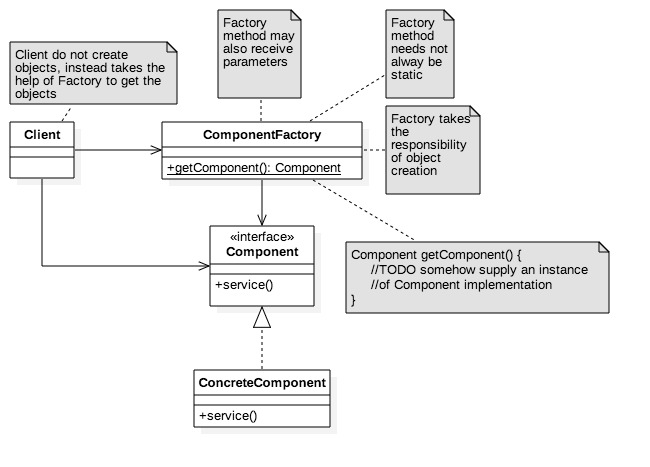
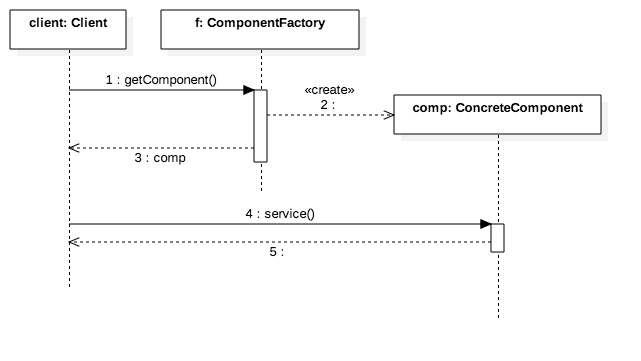

# Factory Design Pattern #

###Objective###
Factory is to separate the responsibility of object creation from it's user.

###Point of Application###
When a client needs to have a business object

###Structural Model###



###Behavioral Model###



###Illustration: Simple Factory###

Component.java

```
package com.glarimy.factory;

public interface Component {

	public void service();

}

```

ConcreteComponent.java

```
package com.glarimy.factory;

public class ConcreteComponent implements Component {

	public ConcreteComponent() {
		System.out.println("Concrete Component: constructor");
	}

	@Override
	public void service() {
		System.out.println("Concrete Component: service");
	}

}

```

ComponentFactory.java

```
package com.glarimy.factory;

public class ComponentFactory {

	public static Component getComponent() {
		return new ConcreteComponent();
	}

}

```

Client.java

```
package com.glarimy.factory;

public class Client {

	public static void main(String[] args) {
		Component component = ComponentFactory.getComponent();
		component.service();
	}
}

```

###Illustration: Common Factory###

CommonFactory.java

```
package com.glarimy.factory;

import java.io.FileReader;
import java.util.Properties;

public class CommonFactory {

	public static Object get(String key) throws Exception {
		Properties props = new Properties();
		props.load(new FileReader("conf.properties"));
		return Class.forName(props.getProperty(key)).newInstance();
	}

}

```

conf.properties

```
component=com.glarimy.factory.ConcreteComponent
```

CommonFactoryClient.java

```
package com.glarimy.factory;

public class CommonFactoryClient {

	public static void main(String[] args) throws Exception {
		Component component = (Component) CommonFactory.get("component");
		component.service();
	}

}

```
