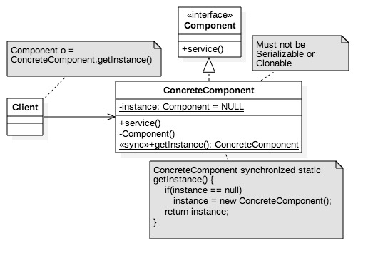

# Singleton Design Pattern #

###Objective###
To limit the number of instances of a class to a maximum of one.

###Structural Model###



###Illustration: Singleton###

Component.java

```
package com.glarimy;

public interface Component {

	public void service();

}

```

ConcreteComponent.java

```
package com.glarimy;

@Singleton(factoryMethod="getInstance")
public class ConcreteComponent implements Component {
	private static ConcreteComponent INSTANCE;

	private ConcreteComponent() {
		System.out.println("Concrete Component: constructor");
	}

	public static synchronized ConcreteComponent getInstance() {
		if (INSTANCE == null)
			INSTANCE = new ConcreteComponent();
		return INSTANCE;
	}

	@Override
	public void service() {
		System.out.println("Concrete Component: service");
	}

}

```

ClientOne.java

```
package com.glarimy;

public class ClientOne {

	public static void main(String[] args) throws Exception {
		Component component = ConcreteComponent.getInstance();
		component.service();
	}

}

```

###Illustration: Factory based on convention###

FactoryWithConventions.java

```
package com.glarimy;

import java.io.FileReader;
import java.lang.reflect.Method;
import java.util.Properties;

public class FactoryWithConventions {

	@SuppressWarnings("unchecked")
	public static Object get(String key) throws Exception {
		Properties props = new Properties();
		props.load(new FileReader("conf.properties"));
		@SuppressWarnings("rawtypes")
		Class claz = Class.forName(props.getProperty(key));
		try {
			return claz.newInstance();
		} catch (IllegalAccessException e) {
			Method method = claz.getMethod("getInstance");
			return method.invoke(claz);
		}
	}

}

```

ClientTwo.java

```
package com.glarimy;

public class ClientTwo {

	public static void main(String[] args) throws Exception {
		Component component = (Component) FactoryWithConventions.get("component");
		component.service();
	}

}

```

###Illustration: Factory based on annotations###

Singleton.java

```
package com.glarimy;

import java.lang.annotation.ElementType;
import java.lang.annotation.Retention;
import java.lang.annotation.RetentionPolicy;
import java.lang.annotation.Target;

@Target(ElementType.TYPE)
@Retention(RetentionPolicy.RUNTIME)
public @interface Singleton {
	public String factoryMethod();
}

```

FactoryWithAnnotationSupport.java

```
package com.glarimy;

import java.io.FileReader;
import java.util.Properties;

public class FactoryWithAnnotationSupport {

	@SuppressWarnings("unchecked")
	public static Object get(String key) throws Exception {
		Properties props = new Properties();
		props.load(new FileReader("conf.properties"));
		@SuppressWarnings("rawtypes")
		Class claz = Class.forName(props.getProperty(key));
		try {
			return claz.newInstance();
		} catch (IllegalAccessException e) {
			Singleton singleton = (Singleton) claz.getAnnotation(Singleton.class);
			String name = singleton.factoryMethod();
			return claz.getMethod(name).invoke(claz);
		}
	}
}

```

ClientThree.java

```
package com.glarimy;

public class ClientThree {

	public static void main(String[] args) throws Exception {
		Component component = (Component) FactoryWithAnnotationSupport.get("component");
		component.service();

	}

}

```