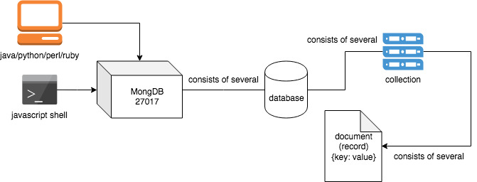
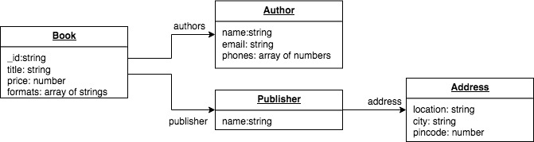
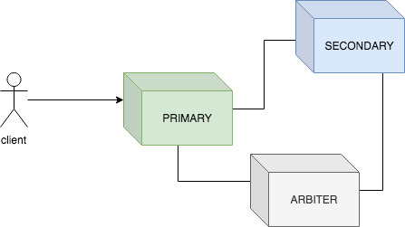
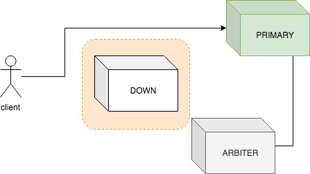
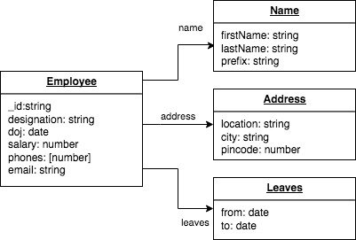

# MongoDB #

MongoDB is a general purpose database to build web scale applications.

**Contents**

1. [Introduction](##Introduction)
2. [Hello World](##Hello World)
3. [Architecture](##Architecture)
4. [Interacting with MongoDB](##Interacting with MongoDB)
5. [Replica Sets](##Replica Sets)
6. [Administration](##Administration)
7. [Architecture](#Architecture)

## Introduction ##

1. MongoDB is document based. A document is a record with a set of key-value pairs. 
2. A document may contain strings, numbers, booleans, arrays and also embed documents of any depth.
3. Maximum size of a document is 16MB.
4. Documents are identified with unique `_id` key. If not supplied, MongoDB generates one.
5. Documents can be searched on any key within the document.
6. CRUD operations are executed using MongoDB API available in Javascript, Java, Python, Ruby and etc., 
7. Restrictions, Projections, Aggregations are supported.
8. No support for joins.
9. Snapshot based transactions across collections/databases are supported
10. Documents are stored in collections which are schemaless. 
11. A maximum of 64 indexes can be created on a collection.
12. Capped collection can be defined with maximum size or maximum number of documents. Useful for log rotation.
13. Sharding helps in data partition and load balancing
14. Relication improves fault tolerance  

## Hello World ##

1. Download MongoDB from [https://www.mongodb.com/download-center/community](https://www.mongodb.com/download-center/community)
2. Extract the archive into a folder which will be referred as `/path/to/server` in this document
3. Create a folder (not under `/path/to/server`) to store the data which will be referred as `/path/to/data` in this document
4. Open a terminal, go to the `bin` folder under `/path/to/server` and start the MongoDB server

	```
	cd /path/to/server/bin
	```

	```
	sudo ./mongodb -dbpath /path/to/data
	```

5. Open another terminal, go to the `bin` folder under `/path/to/server` and start the MongoDB Javascript client to get the prompt

	```
	cd /path/to/server/bin
	```

	```
	sudo ./mongod
	```

6. On the client prompt, run the commands

	```
	use glarimy
	```

	```
	db.messages.insert({"message":"Hello World"})
	```

	```
	db.messages.find().pretty()
	```

	```
	db.messages.drop()
	```

6. Clear the shell screen

	```
	cls
	```

## Architecture ##

The components of MongoDB architecture include mongod, mongo, mongos, databases, collections, documents, api and indexes.



1. `mongod` is the deamon that runs the MongoDB server, runs on 27017 port, by default
2. `mongos` is the deamon that runs the MongoDB sharding engine, runs on 27019 port, by default
3. `mongo` is the javascript shell to interact with the server
4. `document` is a data record stored in `BSON` format
5. `collection` is a named set of data records 
6. `database` is a named set of collections
7. `api` is the interface through with drivers of different languages interact with the MongoDB server
8. `index` to speed up the data retrieval

## Interacting with MongoDB ##

Start the MongoDB server and run the Javascript shell to try the following on the prompt

### Database Operations ###

Lists the databases

```
show dbs
```

Creates a new database by name **glarimy**, if not already available and switches to the database

```
use glarimy
```

Displays the current database name

```
db
```

Drops the current database

```
db.dropDatabase()
```

### Collection Operations ###

Lists collections in a given database

```
show collections
```

Creates a new collection by name **books**

```
db.createCollection("books")
```

Creates a capped collection by name **logs**. Maximum size of this collection limited to 16MB

```
db.createCollection("logs", {"capped": true, "size": 16384});
```

Drops the collection named **logs**

```
db.logs.drop();
```

Prints the number of documents in the collection **books*

```
db.books.count()
```

### Document Operations ###

The operations on documents are CRUD operations. 
All the following illustrations assume that the collection by name **books** is available in the current database.
The documents are exepcted by in the JSON format, when using Javascript client.

Following the structure of the book document.



**CREATE OPERATIONS**

Adds a document to the collection

```
db.books.insert({
	_id: 123,
	title: "Introduction to MongoDB",
	price: 230,
	formats: ["Print", "PDF", "Kindle"],
	authors: [{
		name: "Krishna",
		phones: [9731423166],
		email: "krishna@glarimy.com"
	}],
	publisher: {
		name: "Glarimy Technology Services",
		address: {
			location: "Vars Casa Rosa, 1st Main, Pai Layout",
			city: "Bengaluru",
			pincode: 534101
		}
	}	
})
```

Adds multiple documents to the collection

```
db.books.insertMany([{
	_id: 234,
	title: "Introduction to NoSQL Databases",
	price: 500,
	formats: ["PDF", "Kindle"],
	image: 'cover_234.jpg',
	authors: [{
		name: "Krishna",
		phones: [9731423166],
		email: "krishna@glarimy.com"
	}],
	publisher: {
		name: "Glarimy Technology Services",
		address: {
			location: "Vars Casa Rosa, 1st Main, Pai Layout",
			city: "Bengaluru",
			pincode: 534101
		}
	}	
},{
	_id: 345,
	title: "MongoDB Essentials",
	price: 150,
	formats: ["Print"],
	authors: [{
		name: "Krishna Mohan Koyya",
		phones: [9731423166],
		email: "krishna@glarimy.com"
	}],
	publisher: {
		name: "Glarimy Technology Services",
		address: {
			location: "Vars Casa Rosa, 1st Main, Pai Layout",
			city: "Bengaluru",
			pincode: 534101
		}
	}	
}])
```

**READ OPERATIONS**

Fetches all documents from the collection

```
db.books.find()
```

Prints the documents with format

```
db.books.find().pretty()
```

Fetches the documents that matches the restrictions 

```
db.books.find({"_id": 123}).pretty()
```

Fetches the documents that matches multiple restrictions

```
db.books.find({"_id": 123, "title": "Introduction to MongoDB" }).pretty()
```

Fetches the documents that matches any one of the restrictions

```
db.books.find({"$or": [{"_id": 123}, {"title": "MongoDB Essentials" }]}).pretty()
```

Fetches documents by including only the selected fields 

```
db.books.find({"$or": [{"_id": 123}, {"title": "MongoDB Essentials" }]}, {_id: 1, title: 1, price: 1}).pretty()
```

Fetches documents by excluding only the selected fields 

```
db.books.find({"$or": [{"_id": 123}, {"title": "MongoDB Essentials" }]}, {authors: 0, publisher: 0}).pretty()
```

Fetches documents with a restriction on an embedded document

```
db.books.find({"publisher.address.city": "Bengaluru"},{_id: 1, title: 1}).pretty()
```

Fetches documents only when a field exists

```
db.books.find({"image": {$exists: true}}, {_id: 1, title: 1}).pretty()
```

Fetches only one document (with or without match)

```
db.books.findOne({},{_id: 1, title: 1})
```

Fetches with ``like`` restriction using regular expressions

```
db.books.find({title: /MongoDB/},{_id: 1, title: 1}).pretty()
```

Fetches with ``in`` restriction

```
db.books.find({formats: {"$in": ["Kindle", "Print"]}},{_id: 1, title: 1}).pretty()
```

Fetches with comparision restrictions

```
db.books.find({price: {"$lte": 400}},{_id: 1, title: 1, price: 1}).pretty()
```

Fetches with a projection on embedded documents

```
db.books.find({price: {"$lte": 400}},{_id: 1, title: 1, price: 1, "publisher.name": 1}).pretty()
```

Fetches based on array fields

```
db.books.find({authors: {"$gte": {"$size": 1}}},{_id: 1, title: 1, "authors.$": 1}).pretty()
```

Fetches with sort

```
db.books.find({}, {_id: 1, title: 1, price: 1}).sort({title: 1, price: -1}).pretty();
```

Fetches only a page of 2 documents

```
db.books.find({}, {_id: 1, title: 1, price: 1}).limit(2).pretty();
```

Fetches the second page with size 2

```
db.books.find({}, {_id: 1, title: 1, price: 1}).skip(2).limit(2).pretty();
```

**UPDATE OPERATIONS**

Updates all documents to add discount field

```
db.books.updateMany({},{"$set": {"discount": 5}})
```

Update documents conditionally

```
db.books.updateMany({price: {$gt: 300}}, {$set: {discount: 10}})
```

Updates a specific element in array

```
db.books.updateMany({}, {$push: {"authors.0.phones": 08040958066}})
```

**DELETE OPERATIONS**

Deletes selectd documents

```
db.books.remove({_id: 234})
```

Deletes all documents in an array

```
db.books.remove({})
```

### Index Operations ###

Every document is automatically indexed based on the `_id`. 
In total, 64 indexes can be created on a collection.

The followin illustrations assume a collection by name **books** exists with documents.

**Gets indexes**

```
db.books.getIndexes()
```

**Adds a new index with ascending order**

```
db.books.createIndex({'title': 1})
```

**Adds a new named index with ascending order**

```
db.books.createIndex({'title': 1}, {name: "title-index"})
```

**Drops an index**

```
db.books.dropIndex("title-index");
```

## Replica Set ##

1. A replica-set is an arrangement for fault-tolerance
2. A replica set consists of a minimum of one instance of MongoDB, but it is useless for fault-tolerance
3. General guideline is to have odd number of instances in a replica set
4. A useful minimal replica set is 3
5. Every replica set have exactly one instance acting as PRIMARY
6. Good to have one instance acting as ARBITER
7. All other instances act as SECONDARY
8. All instances exchange regular heart-beats
8. All regular database operations are executed on PRIMARY
9. PRIMARY instance replicates the data on all SECONDAY instances
10. ARIBTER doesn't maintain any database
	
	

11. When PRIMARY is down, one of the SECONDARY isntances automatically elects itself as the PRIMARY. 
12. ARBITER, when present, solves the ties in elections
	
	

13. When original PRIMARY comes back, it acts only as SECONDARY
14. No regular operations are allowed on SECONDARY instance, by default
15. READ operations can be enabled on SECONDAY
16. SECONDARY instances can be used for taking backup

**Setting up Replica Set**

Create three different folders for acting as databases for three nodes

```
mkdir /path/to/db1
mkdir /path/to/db2
mkdir /path/to/db3
```

Start three instances of MongoDB servers on three different terminals

```
./mongod --replSet glarimy --dbpath /path/to/db1 --port 19721
./mongod --replSet glarimy --dbpath /path/to/db2 --port 19722
./mongod --replSet glarimy --dbpath /path/to/db3 --port 19723

```

Login to one of the instances

```
./mongo --port 19721
```

Prepare the replicate on the prompt

```
rs.initiate()
rs.add("localhost:19722")
rs.add("localhost:19723", {arbiterOnly: true})
```

The prompt is expected to be changed as PRIMARY.

Check the status of replica set

```
rs.status()
rs.isMaster()
```

**Using Replica Set**

Login to PRIMARY

```
./mongo --port 19721
```

Add a document

```
use glarimy
db.messages.insert({"message": "hello world"})
```

Login to SECONDARY

```
./mongo --port 19722
```

Enable the SECONDARY for read operations

```
rs.slaveOk()
```

Verify that the document is replicated to the SECONDARY

```
use glarimy
db.messages.find()
```

Further, shutdown the PRIMARY instance and verify that the SECONDARY automatically turns into PRIMARY.

## Administration ##

### Loading a script to do operations ###

Have a javascript file, say `/path/to/employees.js` with this content. 
This script creates a collection **employees** and adds random documents into it. 

```
db.employees.drop();
var fnames = ["Krishna", "Vishnu", "Sriram", "Karuna", "Latha", "Vijay", "Dhanu", "Manas", "Madhu", "Syam"];
var lnames = ["Koyya", "Pandey", "Mittal"];
var cities = ["Bengaluru", "Mysuru", "Manguluru"];
var pin = 560000;
var phone = 9731423166

for(var i=0; i<fnames.length; i++){
	for(var j=0; j<lnames.length; j++){
		var name = {
			fname : fnames[i],
			lname : lnames[j]
		}
		if(i%3==0) 
			name.prefix = "Dr";

		var designation = "Software Engineer";

		if(i%4==0)
			designation = "Engineering Manager";

		var address = {
			location: "street no: " + (j+1),
			pincode: pin++,
			city: cities[j]
		}
		var record = {
			name: name,
			address: address,
			salary: (i+1) * (j+1) * 1000,
			doj: new Date('2019-'+(j+1)+'-'+(i+1)),
			phones: [phone++, phone++],
			designation: designation,
			email: name.fname+"."+name.lname+"@glarimy.com",
			leaves: []
		}
		db.employees.insert(record);
	}
}
```

Load the script into the database using Javascript shell

```
use glarimy
load('/path/to/employees.js')
```

Verify that the results

```
db.employees.find().pretty()
```

The structure of the document is as follows


