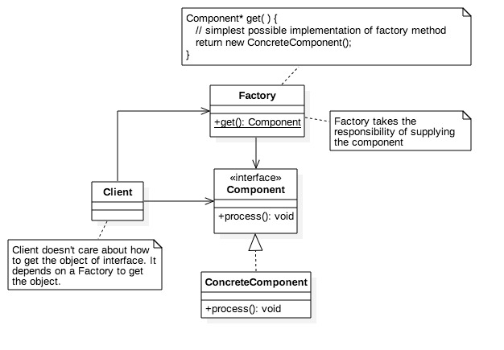

#Factory Pattern
Objective: To separate the responsibility of object creation from it's user

##Pattern Structure



##Pattern Illustration
The following demonstrates tight coupling between the client and business object.
```
#include <iostream>
using namespace std; 

class Component 
{
    public:
        Component();
        void process();
};

Component::Component()
{
    
}

void Component::process()
{
    cout << "Component::process => processing" << endl;
}

int main()
{
    cout << "Client::main => creating a component" << endl;
    Component* component = new Component();
    cout << "Client::main => using the component" << endl;
    component->process();
    return 0;
}
```

The following uses a factory to couple the client and business object loosely
```
#include <iostream>
using namespace std; 

class Component 
{
    public:
        virtual void process() = 0;
};

class Factory
{
    public:
        static Component* getComponent();
};

class ConcreteComponent : public Component
{
    public:
        ConcreteComponent();
        void process();
};

ConcreteComponent::ConcreteComponent()
{
    
}

void ConcreteComponent::process()
{
    cout << "ConcreteComponent::process => processing" << endl;
}

Component* Factory::getComponent()
{
    cout << "Factory::getComponent => creating and supplying component" << endl;
    return new ConcreteComponent();
}


int main()
{
    cout << "Client::main => requesing factory for a component" << endl;
    Component* component = Factory::getComponent();
    cout << "Client::main => received component" << endl;
    cout << "Client::main => using component" << endl;
    component->process();
    return 0;
}
```
##Pattern Application
An application of factory
```
#include <iostream>
#include <sys/time.h>

using namespace std;

class Credentials
{
    public:
        string uid;
        string password;
        Credentials()
        {

        }
        Credentials(string uid, string password)
        {
            this->uid = uid;
            this->password = password;
        }
};

class User
{
    public:
        string uname;
        Credentials credentials;
        User()
        {

        }
        User(string uname, Credentials credentials)
        {
            this->uname = uname;
            this->credentials = credentials;
        }
};

class Security
{
    public:
        virtual void signup(User user) = 0;
        virtual string signin(Credentials Credentials) = 0;
        virtual void signout(string uid) = 0;
};

class SimpleSecurity: public Security
{
    private:
        User users[10];
        string logins[10];
        int count;
    public:
        SimpleSecurity()
        {
            count = 0;
        }
        void signup(User user){
            int index;
            for(index=0; index<count; index++)
            {
                if(users[index].credentials.uid == user.credentials.uid)
                    throw "User already exists";
            }
            users[count++] = user;
            logins[count++] = "";
        }
        string signin(Credentials credentials){
            int index;
            for(index=0; index<count; index++)
            {
                if(users[index].credentials.uid == credentials.uid)
                {
                    if(logins[index] != "")
                    {
                        throw "User already signed in";
                    }else{
                        logins[index] = users[index].uname;
                        return logins[index];
                    }
                }
            }
            throw "User doesn't exist";
        }
        void signout(string uid){
            int index;
            for(index=0; index<count; index++)
            {
                if(users[index].credentials.uid == uid)
                {
                    if(logins[index] == "")
                    {
                        throw "User not signed in yet";
                    }else{
                        logins[index] = "";
                        return;
                    }
                }
            }
            throw "User doesn't exist";
        }
};

class SecurityFactory 
{
    public:
        static Security* getSecurity(string type){
            if(type == "simple")
            {
                return new SimpleSecurity();
            }
            throw "No security component found of type " + type;
        }
};

int main()
{
    Credentials creds = Credentials("koyya", "123456");
    User user = User("Krishna Mohan Koyya", creds);
    try {
        Security* security = SecurityFactory::getSecurity("simple");
        security->signup(user);
        cout << "User successfully signed up" << endl;
        string name = security->signin(creds);
        cout << "User successfully signed in as " << name << endl;
        security->signout(creds.uid);
        cout << "user successfully signed out" << endl;
    } catch(string error){
        cout << error << endl;
    }
}
```