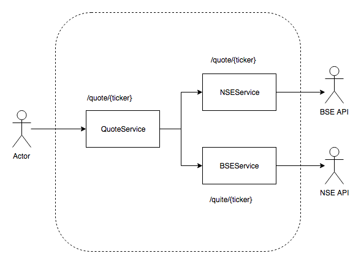

# Assignment on Service Orchestration using Kubernetes #

Develop the following services and deploy them to scale using Kubernetes.

Deliverables:
1. Dockerized REST API for all three services (Quote, NSE and BES)
2. Unit/Component test cases for all three services using JUnit and Spring-Test
3. Contractual test cases for all three services using Hoverfly
4. Dockerized integration test service
5. Kubernetes deployment files
6. Script to deploy the orchestrated services